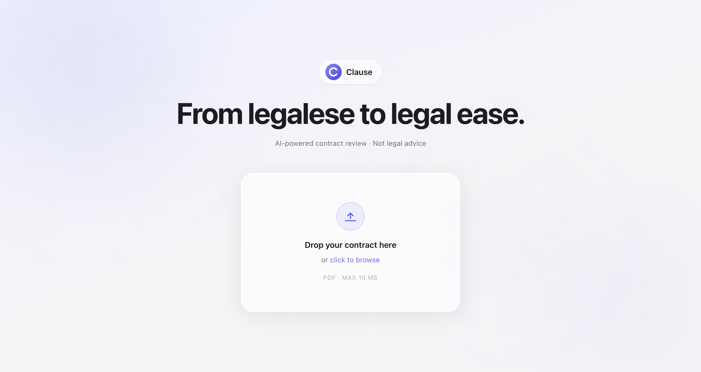
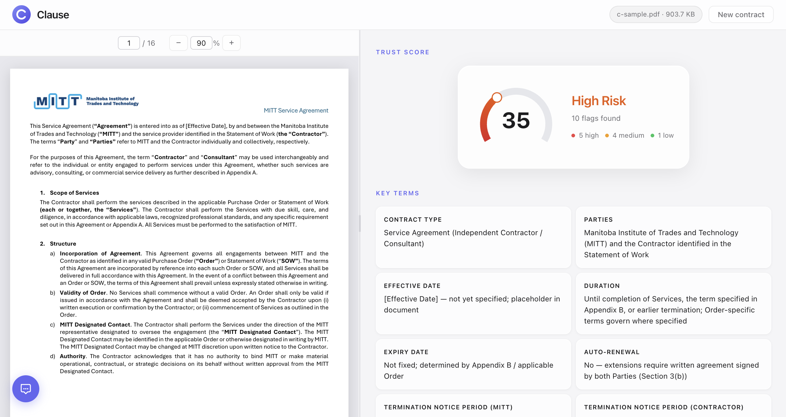
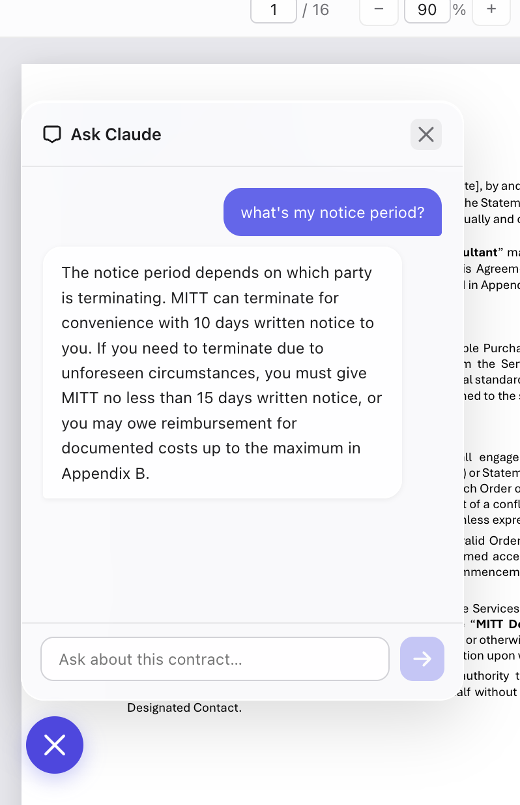
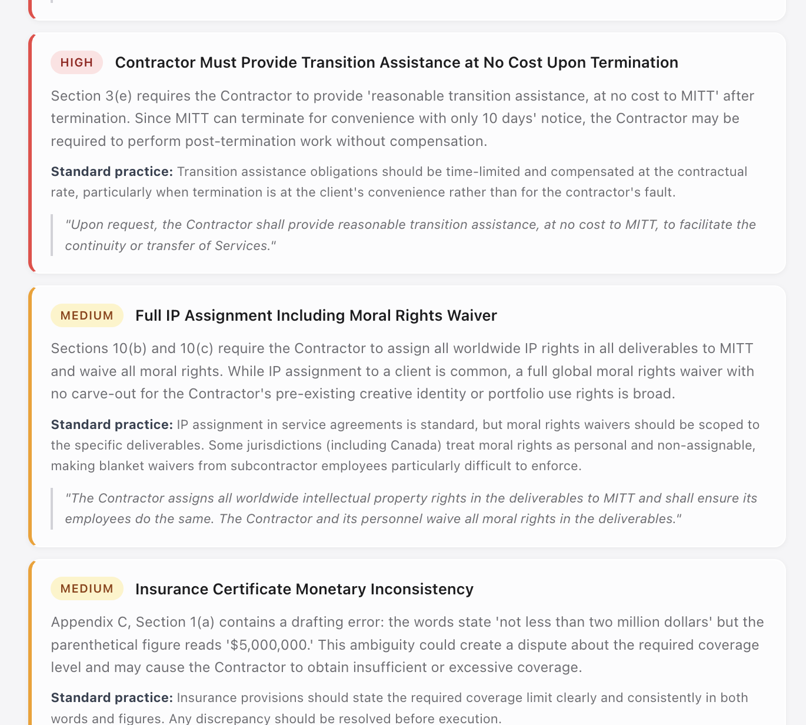

# Clause

AI-powered contract review. Upload a PDF contract and get an instant risk score, flagged issues, key terms, and a chatbot to ask questions about the document.

**Upload** a contract PDF and get an instant analysis — no account needed.



**Risk score, key terms, and flagged clauses** — all extracted and ranked by severity.



**Ask Claude** questions about the contract in plain English via the floating chatbot.



**Flags** are categorized as high, medium, or low severity with the relevant clause quoted.



## Stack

- **Frontend**: React + TypeScript, deployed on Vercel
- **Backend**: FastAPI + Python, deployed on Render
- **AI layer**: claude-sonnet-4-6

## Local development

### Prerequisites
- Node.js 18+
- Python 3.10+
- Anthropic API key

### Backend

```bash
cd backend
python -m venv venv
source venv/bin/activate
pip install -r requirements.txt
```

Create `backend/.env`:
```
ANTHROPIC_API_KEY=your_key_here
```

```bash
uvicorn main:app --reload --port 8001
```

### Frontend

```bash
cd frontend
npm install
```

Create `frontend/.env.local`:
```
REACT_APP_API_URL=http://localhost:8001
```

```bash
PORT=3001 npm start
```

Open `http://localhost:3001`.

## Deployment

Hosted on [Render](https://render.com) (backend) and [Vercel](https://vercel.com) (frontend).
